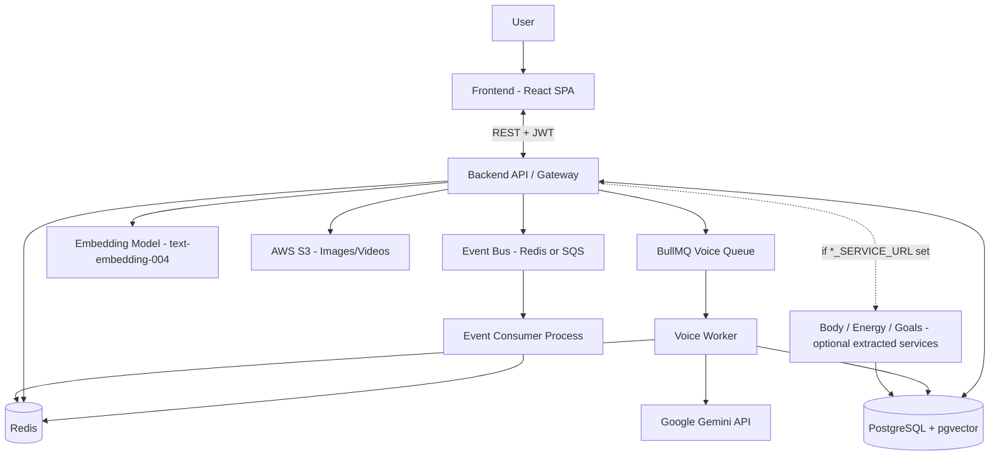
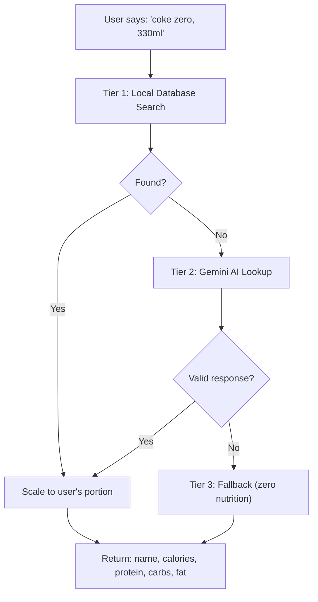
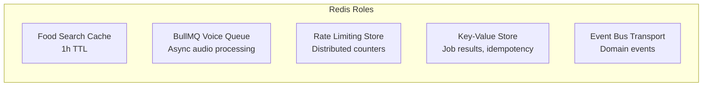
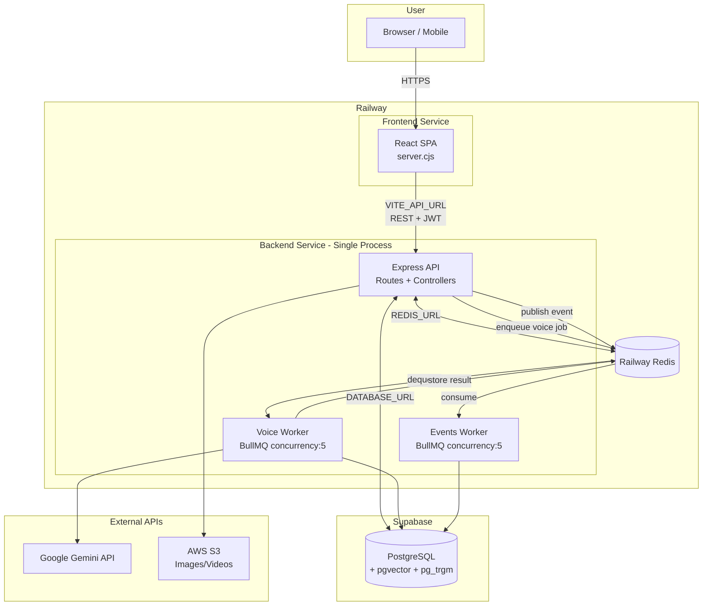
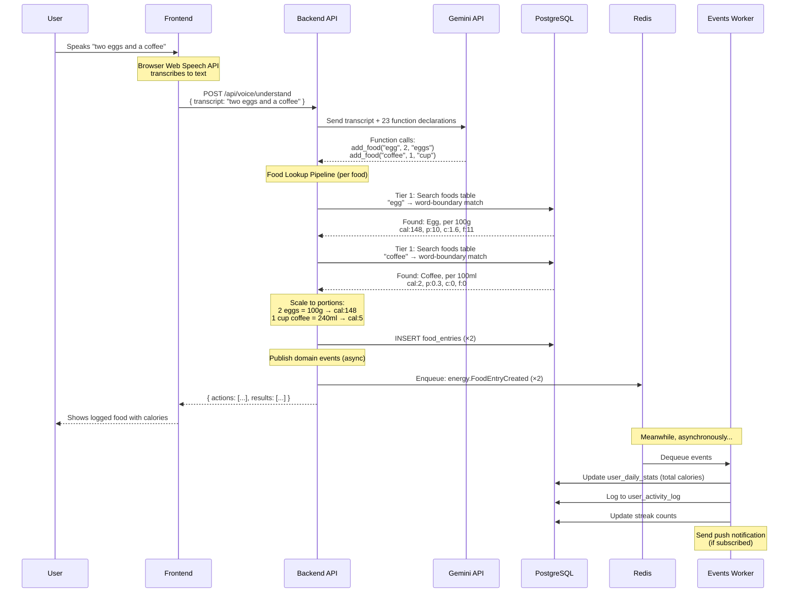
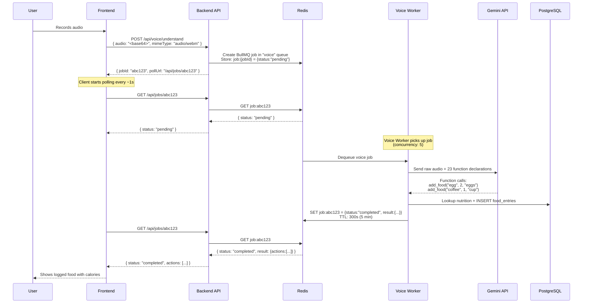
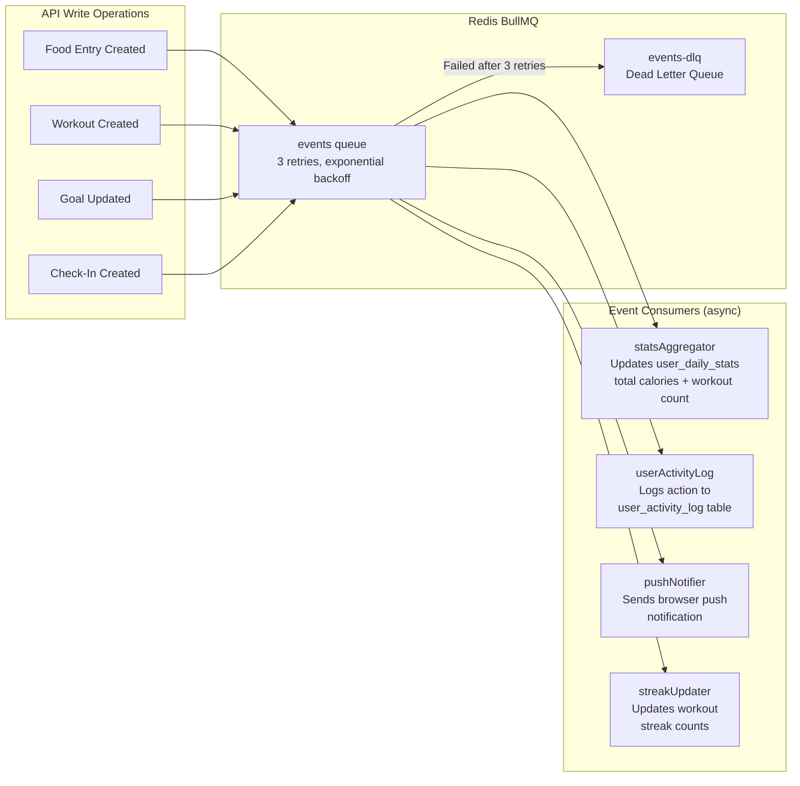

# TrackVibe -- Wellness & Fitness Tracking Application

**TrackVibe** is a full-stack, mobile-first wellness application for tracking **body** (workouts, exercises), **energy** (food, calories, macros, sleep), and **goals**. It features a **voice agent** powered by Google Gemini that understands natural language, an **intelligent food lookup pipeline** that combines a curated database with LLM-generated nutrition data, **vector embeddings** for semantic search, and **Redis-backed caching** for performance.

Built with **React + TypeScript + Vite** (frontend), **Node.js + Express + TypeScript** (backend), **PostgreSQL + pgvector** (database), and optional **Redis** (caching, queues, event bus).

---

## Table of Contents

- [Features](#features)
- [Architecture](#architecture)
- [Tech Stack](#tech-stack)
- [LLM / Gemini Integration](#llm--gemini-integration)
- [Food Lookup Pipeline](#food-lookup-pipeline)
- [Food Search & Vector Embeddings](#food-search--vector-embeddings)
- [Redis Architecture](#redis-architecture)
- [Database](#database)
- [Image & Video Handling](#image--video-handling)
- [Voice Flow](#voice-flow)
- [Meal Copying & Repetition](#meal-copying--repetition)
- [Future: Meal Plan Feature](#future-meal-plan-feature)
- [Environment Variables](#environment-variables)
- [Quick Start](#quick-start)
- [Docker](#docker)
- [Deployment](#deployment)
- [Project Structure](#project-structure)
- [Documentation](#documentation)

---

## Features

### Dashboard (Home)
- Goals progress overview with visual indicators
- Quick stats: workouts, energy intake, sleep hours
- Navigation hub to all areas

### Body (Workouts)
- Workout logging with exercise details: name, sets, reps, weight (kg)
- Workout types: strength, cardio, flexibility, sports
- Weekly workout streak and frequency charts
- Exercise catalog with images and demonstration videos

### Energy (Food & Sleep)
- **Food tracking** with calories and full macros (protein, carbs, fat)
- **Voice-powered food entry** -- say "two eggs and a coffee" and it logs both items with accurate nutrition
- **Intelligent food lookup** -- 2-tier pipeline that checks a curated database first, then asks Gemini AI for unknown foods
- Daily wellness check-ins and sleep tracking
- Calorie and macro trend charts
- Barcode scanning for packaged foods (Open Food Facts integration)

### Goals
- Goal types: calories, workouts, sleep
- Goal periods: weekly, monthly, yearly
- Progress tracking against targets

### Voice Agent
- Natural language input for all operations: add/edit/delete workouts, food, sleep, goals
- Powered by Google Gemini with function calling (23 tool declarations)
- **Text mode** (sync): Send text, get parsed actions immediately
- **Audio mode** (async, requires Redis): Send base64 audio, backend enqueues job, client polls for result
- Food-only phrases (e.g., "Diet Coke") automatically routed to `add_food`
- **Fallback guarantee**: If Gemini blocks or fails, returns `add_food` with the transcript as name and zero nutrition -- the user is never blocked

### Authentication
- Email/password signup and login
- Social login: Google, Facebook, Twitter (when configured)
- JWT-based sessions with protected routes
- Admin role with user management capabilities

### Additional Tracking
- **Weight entries** -- daily weight logging with trend visualization
- **Water intake** -- glass-based tracking (1 glass = 250ml)
- **Menstrual cycle** -- period start/end, flow intensity, symptoms, notes
- **User profile** -- height, target weight, activity level, date of birth

---

## Architecture



### Component Descriptions

| Component | Role |
|-----------|------|
| **Frontend** | React SPA with TanStack Query for server state, React Router for navigation, Tailwind + shadcn/ui for styling. Stores JWT in localStorage. |
| **Backend / Gateway** | Express API handling auth, domain CRUD (workouts, food entries, check-ins, goals), food search, voice understanding, file uploads. When `*_SERVICE_URL` env vars are set, proxies those paths to extracted services. |
| **PostgreSQL + pgvector** | Primary data store. Stores users, workouts, food entries, goals, and the `foods` reference table (~2000+ items). The `pgvector` extension enables 768-dimensional vector similarity search via HNSW indexes. |
| **Redis** | Optional but recommended. Provides: distributed rate limiting, food search caching (1h TTL), BullMQ voice job queue, key-value store for job results, and event bus transport. |
| **Voice Worker** | Processes audio jobs from BullMQ. Calls Gemini API, writes results to Redis for client polling. |
| **Google Gemini** | LLM used for two purposes: (1) voice intent parsing via function calling, (2) nutrition data lookup for foods not in the database. |
| **Embedding Model** | Google's `text-embedding-004` generates 768-dim vectors for semantic search across food entries and workouts. |
| **AWS S3** | Stores user-uploaded images and videos (food photos, exercise demos, avatars, workout photos) via pre-signed URLs. |
| **Event Bus** | Publishes domain events after every write operation. Transport: Redis BullMQ (default) or AWS SQS. Optional event-consumer process runs handlers. |

### Deployment Modes

| Mode | Description | Redis Required |
|------|-------------|----------------|
| **A -- Single process** (default) | One `node index.js` process handles everything. Events are in-memory if Redis is not set. | No |
| **B -- API + event consumer** | Two processes: API (publishes events) and `node workers/event-consumer.js` (consumes events). | Yes |
| **C -- Gateway + extracted services** | Set `*_SERVICE_URL` env vars. Main app acts as gateway, proxying requests to separate Body/Energy/Goals services. | Yes |

---

## Tech Stack

| Layer | Technologies |
|-------|-------------|
| **Frontend** | React 18, TypeScript, Vite, Tailwind CSS, shadcn/ui (Radix), Recharts, React Router v6, TanStack Query, React Context, Zod, React Hook Form |
| **Backend** | Node.js 20 (ES modules), Express, TypeScript, tsup (build), Pino (logging), Helmet (security headers) |
| **Database** | PostgreSQL with pgvector, pg_trgm extensions. node-pg-migrate for migrations, Prisma for schema management |
| **Auth** | JWT (jsonwebtoken), bcrypt, google-auth-library. Optional OAuth: Google, Facebook, Twitter |
| **Voice/LLM** | Google Gemini (`@google/generative-ai`), function calling, `gemini-2.5-flash` (configurable) |
| **Embeddings** | Google `text-embedding-004`, 768 dimensions, pgvector with HNSW cosine index |
| **Cache/Queue** | Redis, BullMQ, rate-limit-redis |
| **Event Bus** | BullMQ (Redis) or AWS SQS. Zod-validated event envelopes |
| **File Storage** | AWS S3 with pre-signed URLs |
| **Testing** | Vitest (backend), React Testing Library (frontend), Playwright (E2E) |
| **Mobile** | Expo React Native, Capacitor |
| **CI/CD** | GitHub Actions (lint, test, build, Docker, Lighthouse PWA checks) |

---

## LLM / Gemini Integration

TrackVibe uses Google Gemini in two distinct roles:

### 1. Voice Intent Parsing

When a user speaks or types natural language (e.g., "I had two eggs and a coffee for breakfast"), the backend sends the text to Gemini along with **23 function declarations** (tools). Gemini returns structured function calls that the backend executes.

**Flow:**
```
User input: "I had two eggs and a coffee"
     |
     v
POST /api/voice/understand { text: "I had two eggs and a coffee" }
     |
     v
Gemini receives: system prompt + user text + 23 function declarations
     |
     v
Gemini returns: [
  { name: "add_food", args: { food: "egg", amount: 2, unit: "eggs" } },
  { name: "add_food", args: { food: "coffee", amount: 1, unit: "cup" } }
]
     |
     v
Backend executes each action:
  - lookupNutrition("egg", 2, "eggs") → { calories: 143, protein: 12.6, ... }
  - lookupNutrition("coffee", 1, "cup") → { calories: 2, protein: 0.3, ... }
  - INSERT into food_entries for each
     |
     v
Response: { actions: [...], results: [...] }
```

**Function declarations** include: `add_food`, `edit_food_entry`, `delete_food_entry`, `add_workout`, `edit_workout`, `delete_workout`, `log_sleep`, `add_goal`, `edit_goal`, `delete_goal`, `log_weight`, `log_water`, `log_cycle`, `update_profile`, and trainer variants for managing other users' data.

**Safety settings:** All harm categories are set to `BLOCK_NONE` to prevent the model from refusing food-related queries that might be misclassified (e.g., "I ate a bloody steak" could trigger harm filters).

**Fallback behavior:** If Gemini blocks the response or returns an error, the backend returns an `add_food` action with the raw transcript as the food name and zero nutrition values. This ensures the user is never stuck -- they can always log food and edit the details later.

### 2. Food Nutrition Lookup

When a food is not found in the local database, Gemini is used as a nutrition data assistant. See [Food Lookup Pipeline](#food-lookup-pipeline) for the full flow.

---

## Food Lookup Pipeline

The food lookup pipeline resolves a food name (e.g., "coke zero") to complete nutrition data. It uses a **2-tier strategy** with a graceful fallback.



### Tier 1: Local Database

The `getNutritionForFoodName()` function searches the `foods` table using multiple matching strategies:

1. **Word-boundary regex** on `common_name` and `name` -- "chicken breast" finds "Chicken breast, grilled" even when words aren't adjacent
2. **Trigram similarity** (pg_trgm) > 0.6 -- handles typos like "chiken" matching "chicken"
3. Results are ranked by: exact match > prefix match > similarity score > cooking method preference > name length (shorter = more specific)

If found, nutrition is **scaled to the user's portion**: `(user_grams / 100) * per_100g_value`.

### Tier 2: Gemini AI

When the food is not in the database and `GEMINI_API_KEY` is configured, the `lookupAndCreateFood()` function:

1. **Sends a structured prompt** to Gemini asking for nutrition data in a specific JSON format
2. **Validates the response** with a Zod schema that enforces ranges:
   - `calories`: 0-1000 kcal per 100g/100ml
   - `protein`, `carbs`, `fat`: 0-100g each
   - `is_liquid`: boolean (determines per-100g vs per-100ml)
   - `serving_sizes_ml`: { can, bottle, glass } for liquids
   - `default_unit`: for countable foods (egg, slice, can)
   - `unit_weight_grams`: weight per unit (50g for an egg)
   - `search_aliases`: informal names (["coke zero", "zero"] for "Coca-Cola Zero Sugar")
3. **Checks for duplicates** -- case-insensitive name match or search_aliases match
4. **INSERTs into the `foods` table** with all metadata, making it available for future lookups instantly
5. **Scales** the per-100g values to the user's requested portion and returns the result

### Tier 3: Fallback

If both tiers fail, returns the food name with zero nutrition and `source: 'fallback'`. The user can manually edit the entry. This guarantees the user is never blocked from logging food.

### Example: "zero" to "Coca-Cola Zero Sugar, 330ml"

```
Input: food="zero", amount=330, unit="ml"

Tier 1: Database search for "zero"
  - search_aliases check: "zero" matches ["coke zero", "zero"] on "Coca-Cola Zero Sugar"
  - Returns: { calories: 0.3, protein: 0, carbs: 0, fat: 0, is_liquid: true, per 100ml }
  - Scale: (330 / 100) * values

Output: { name: "Coca-Cola Zero Sugar", calories: 1, protein: 0, carbs: 0, fat: 0, source: "db" }
```

If "Coca-Cola Zero Sugar" were NOT in the database:
```
Tier 2: Gemini prompt → "Food or drink name: zero"
  - Gemini returns: { name: "Coca-Cola Zero Sugar", calories: 0.3, ..., is_liquid: true,
                       serving_sizes_ml: { can: 330, bottle: 500, glass: 250 },
                       search_aliases: ["coke zero", "zero", "coca cola zero"] }
  - Zod validates → passes
  - Duplicate check → not found
  - INSERT into foods table (now cached for all future lookups)
  - Scale to 330ml

Output: { name: "Coca-Cola Zero Sugar", calories: 1, ..., source: "gemini" }
```

---

## Food Search & Vector Embeddings

### Text-Based Food Search

The public `GET /api/food/search?q=<query>` endpoint uses a sophisticated multi-tier search algorithm in `src/models/foodSearch.ts`:

**Matching strategies** (used simultaneously, results ranked by relevance):

| Strategy | How It Works | Example |
|----------|-------------|---------|
| **Word-split LIKE** | All query words must appear in `common_name` or `name` | "chicken breast" matches "Chicken breast, grilled" |
| **Trigram similarity** (pg_trgm) | Fuzzy matching for typos, threshold > 0.15 | "chiken brest" matches "Chicken breast" |
| **Full-text search** (tsvector) | Stemmed word matching via `name_tsv` column | "running" matches "Runner beans" |
| **Search aliases** | Exact match against `search_aliases` text array | "zero" matches Coca-Cola Zero Sugar |

**Relevance ranking** (ORDER BY):
1. Exact name match (highest priority)
2. Search alias exact match
3. Prefix match (name starts with query)
4. Full-text search match
5. Trigram similarity score (higher = better)
6. Cooking method preference ("cooked" preferred over "uncooked")
7. Name length (shorter = more specific)

**Fallback tiers:** If pg_trgm or common_name columns are unavailable (older schema), the search gracefully degrades through 3 fallback tiers, each using fewer features but still returning results.

### Vector Embeddings (Semantic Search)

TrackVibe also supports **semantic search** using vector embeddings for personalized content discovery:

| Property | Value |
|----------|-------|
| **Model** | Google `text-embedding-004` |
| **Dimensions** | 768 |
| **Storage** | PostgreSQL `vector(768)` column via pgvector extension |
| **Index** | HNSW with cosine distance (`vector_cosine_ops`) |
| **Table** | `user_embeddings` with `record_type` (food_entry / workout) |

**How it works:**
1. When a food entry or workout is created, its descriptive text is embedded into a 768-dimensional vector
2. The vector is stored in `user_embeddings` alongside the `record_id` and `record_type`
3. To search, the query text is embedded and compared against stored vectors using cosine similarity
4. Results are ranked by similarity score, enabling fuzzy semantic matching

**Use case:** A user searching for "protein shake" could find their previous entries for "whey protein with milk" or "chocolate protein smoothie" even though the exact words don't match.

---

## Redis Architecture

Redis is **optional** but significantly enhances the application. When `REDIS_URL` is not set, the app uses in-memory alternatives for each feature.



### Food Search Cache

| Property | Value |
|----------|-------|
| **Key pattern** | `food:search:{query}:{limit}` |
| **TTL** | 3600 seconds (1 hour) |
| **Content** | Serialized array of food search results |
| **Invalidation** | TTL-based expiry only |
| **Fallback** | No cache; every request hits PostgreSQL |

When a user searches for "chicken", the first request queries PostgreSQL and stores the result in Redis. Subsequent searches for "chicken" within the hour return instantly from cache.

### BullMQ Voice Queue

Audio voice requests are too slow for synchronous HTTP. The flow:
1. Client POSTs audio (base64) to `/api/voice/understand`
2. Backend creates a BullMQ job with the audio data
3. Returns `{ jobId, pollUrl }` to the client
4. Client polls `GET /api/jobs/:jobId` until status is `completed`
5. Voice worker picks up the job, calls Gemini, writes result to Redis
6. Next poll returns the parsed actions

### Key-Value Store

A generic TTL-enabled key-value store (`src/lib/keyValueStore.ts`):
- Uses Redis when available
- Falls back to an **in-memory Map** with LRU eviction (max 10,000 entries)
- Cleanup interval: 5 minutes
- Used for: job results, idempotency keys, temporary data

### Rate Limiting

| Endpoint | Limit | Window |
|----------|-------|--------|
| All `/api` routes | 200 requests | 15 minutes per IP |
| Auth routes (`/api/auth/login`, `/api/auth/register`) | 10 requests | 15 minutes per IP |

With Redis: distributed `rate-limit-redis` store shared across instances. Without Redis: in-memory store (per-process).

### Event Bus

Domain events (e.g., `energy.FoodEntryCreated`, `body.WorkoutCreated`) are published after every write operation. Transport options:
- **Redis** (default): BullMQ queue named `events`
- **SQS**: AWS SQS queue (set `EVENT_TRANSPORT=sqs` and `EVENT_QUEUE_URL`)

---

## Database

PostgreSQL with pgvector and pg_trgm extensions. Schema managed by node-pg-migrate (migrations) and Prisma (schema definition).

### Core Tables

#### `users`
| Column | Type | Description |
|--------|------|-------------|
| id | uuid | Primary key |
| email | text | Unique email |
| password_hash | text | bcrypt hash |
| name | text | Display name |
| role | text | `admin` or `user` |
| auth_provider | text | `local`, `google`, `facebook`, `twitter` |
| provider_id | text | OAuth provider user ID |

#### `foods` (Reference / Nutrition Database)
| Column | Type | Description |
|--------|------|-------------|
| id | uuid | Primary key |
| name | text | Full name (e.g., "Chicken, breast, boneless, cooked, grilled") |
| common_name | text | Clean name (e.g., "Chicken breast, grilled") |
| calories | numeric | kcal per 100g or 100ml |
| protein | numeric | grams per 100g/100ml |
| carbs | numeric | grams per 100g/100ml |
| fat | numeric | grams per 100g/100ml |
| is_liquid | boolean | true for drinks |
| serving_sizes_ml | jsonb | { can, bottle, glass } in ml (liquids only) |
| preparation | text | "cooked" or "uncooked" |
| default_unit | text | Countable unit: "egg", "slice", "can" |
| unit_weight_grams | numeric | Grams per 1 unit (50 for an egg) |
| search_aliases | text[] | Informal names: ["coke zero", "zero"] |
| barcode | text | Unique barcode (indexed) |
| source | text | "usda", "gemini", "off" (Open Food Facts) |
| image_url | text | S3 URL or external URL |
| name_tsv | tsvector | Full-text search index |

#### `food_entries` (User Food Log)
| Column | Type | Description |
|--------|------|-------------|
| id | uuid | Primary key |
| user_id | uuid | FK to users |
| date | date | Entry date |
| name | text | Food name |
| calories | numeric | Total calories for this entry |
| protein | numeric | Total protein (g) |
| carbs | numeric | Total carbs (g) |
| fats | numeric | Total fat (g) |
| portion_amount | numeric | User's portion (e.g., 200) |
| portion_unit | text | Unit (g, ml, eggs, slices) |
| serving_type | text | Serving type |
| start_time | text | Meal start time HH:MM |
| end_time | text | Meal end time HH:MM |

#### `workouts`
| Column | Type | Description |
|--------|------|-------------|
| id | uuid | Primary key |
| user_id | uuid | FK to users |
| date | date | Workout date |
| title | text | "Push Day", "SS" (Starting Strength) |
| type | text | strength, cardio, flexibility, sports |
| duration_minutes | int | Duration |
| exercises | jsonb | Array of { name, sets, reps, weight } |
| notes | text | Optional notes |

#### `user_embeddings`
| Column | Type | Description |
|--------|------|-------------|
| id | uuid | Primary key |
| user_id | uuid | FK to users |
| record_type | text | "food_entry" or "workout" |
| record_id | text | ID of the food_entry or workout |
| content_text | text | Text that was embedded |
| embedding | vector(768) | 768-dim embedding vector |

#### Other Tables
| Table | Description |
|-------|-------------|
| `daily_check_ins` | Sleep hours per day |
| `goals` | User goals (type, target, period) |
| `weight_entries` | Daily weight log (kg) |
| `water_entries` | Daily water intake (glasses + ml) |
| `cycle_entries` | Menstrual cycle tracking |
| `user_profiles` | Height, weight targets, activity level |
| `user_settings` | Theme, currency, language, timezone |
| `user_daily_stats` | Aggregated daily stats (calories, workout count, sleep) |

---

## Image & Video Handling

TrackVibe uses **AWS S3 with pre-signed URLs** for file uploads. The client never sends file data through the backend -- it uploads directly to S3.

### Upload Flow

```
1. Client: POST /api/uploads/presigned-url { mimeType: "image/jpeg", context: "food" }
2. Backend: Generates pre-signed PUT URL (5-minute expiry)
3. Backend: Returns { uploadUrl, fileUrl }
4. Client: PUT file directly to S3 using uploadUrl
5. Client: Stores fileUrl on the resource (food entry, workout, etc.)
```

### Valid Contexts and MIME Types

| Context | Description |
|---------|-------------|
| `avatar` | User profile picture |
| `workout` | Workout photo |
| `food` | Food photo |
| `exercise-video` | Exercise demonstration video |

| Category | Allowed MIME Types |
|----------|-------------------|
| Images | `image/jpeg`, `image/png`, `image/webp`, `image/gif` |
| Videos | `video/mp4`, `video/quicktime`, `video/webm` |

### S3 File Structure
```
s3://<bucket>/users/<userId>/<context>/<randomId>.<ext>
```

### Food Images
- The `foods` table has an `image_url` column
- USDA foods are seeded with images via migration `1773600000001_seed-food-images.js`
- Gemini-created foods can have images added later
- Food search results include `imageUrl` in the response

---

## Voice Flow

| Mode | Input | Flow | Redis Required |
|------|-------|------|----------------|
| **Text** (sync) | `{ transcript }` | `POST /api/voice/understand` -> Gemini -> `{ actions }` | No |
| **Audio** (async) | `{ audio, mimeType }` | `POST` -> BullMQ job -> `{ jobId, pollUrl }` -> client polls `GET /api/jobs/:jobId` -> worker processes via Gemini -> result stored in Redis | Yes |

### Voice Tools (23 Function Declarations)

The voice system provides Gemini with 23 function declarations covering all CRUD operations:

**Food:** `add_food`, `edit_food_entry`, `delete_food_entry`
**Workouts:** `add_workout`, `edit_workout`, `delete_workout`
**Sleep:** `log_sleep`, `edit_check_in`, `delete_check_in`
**Goals:** `add_goal`, `edit_goal`, `delete_goal`
**Health:** `log_weight`, `log_water`, `log_cycle`, `update_profile`
**Trainer:** `trainer_add_food`, `trainer_add_workout` (manage other users)

### Agent Tools (Extended)

The agent mode adds **7 read/copy tools** on top of voice tools:

- `get_workouts` -- Fetch workouts by date
- `get_food_entries` -- Fetch food entries by date
- `get_goals` -- Fetch all goals
- `get_weight_entries` -- Fetch weight history
- `get_water_today` -- Get today's water intake
- `copy_food_entries` -- Copy all food entries from one date to multiple dates
- `copy_workout` -- Copy a workout to another date

---

## Meal Copying & Repetition

The `copy_food_entries` agent tool enables meal repetition via voice:

**Capability:** Copy all food entries from a source date to one or more target dates.

**Example voice commands:**
- "Copy today's meals to tomorrow"
- "Repeat this meal plan for the whole week"
- "Copy Monday's food to Wednesday and Thursday"

**How it works:**
1. User speaks: "repeat today's meals for the next 3 days"
2. Gemini calls `copy_food_entries` with `{ fromDate: "2026-03-13", toDates: ["2026-03-14", "2026-03-15", "2026-03-16"] }`
3. Backend fetches all food entries for `fromDate`
4. Creates identical entries for each target date
5. Returns confirmation with the number of entries copied

---

## Future: Meal Plan Feature

The following meal plan capabilities are envisioned for future development:

### Planned Features
- **CSV Import**: Upload a CSV file with a weekly meal plan (day, meal, food, portion, calories) to bulk-create food entries
- **Manual Meal Plans**: Create a named meal plan (e.g., "Cutting Diet", "Bulking Plan") with a list of foods per meal (breakfast, lunch, dinner, snacks)
- **Recurring Schedules**: "Repeat this plan every day for 2 weeks" or "Apply this meal plan Monday through Friday"
- **Meal Templates**: Save a day's food entries as a template that can be applied to future dates with one tap

### Current Alternative
Today, users can achieve basic meal repetition using the `copy_food_entries` voice command to duplicate a day's food entries to future dates.

---

## Environment Variables

### Backend (`backend/.env`)

| Variable | Required | Description |
|----------|----------|-------------|
| `DATABASE_URL` | Yes | PostgreSQL connection string |
| `JWT_SECRET` | Yes (production) | Secret for signing JWTs |
| `GEMINI_API_KEY` | For voice/food lookup | Google Gemini API key |
| `GEMINI_MODEL` | No | Model name (default: `gemini-2.5-flash`) |
| `PORT` | No | Server port (default: 3000) |
| `CORS_ORIGIN` | No | Allowed CORS origin |
| `FRONTEND_ORIGIN` | No | Frontend origin (default: `http://localhost:5173`) |
| `REDIS_URL` | No | Redis URL. Enables: caching, async voice, rate limit store, event bus |
| `EVENT_TRANSPORT` | No | `redis` or `sqs` (default: `redis`) |
| `EVENT_QUEUE_URL` | When SQS | SQS queue URL |
| `AWS_REGION` | When SQS/S3 | AWS region |
| `AWS_S3_BUCKET` | For uploads | S3 bucket name |
| `BODY_DATABASE_URL` | No | Per-context DB for Body |
| `ENERGY_DATABASE_URL` | No | Per-context DB for Energy |
| `GOALS_DATABASE_URL` | No | Per-context DB for Goals |
| `BODY_SERVICE_URL` | No | Proxy workout routes to this URL |
| `ENERGY_SERVICE_URL` | No | Proxy food/check-in routes to this URL |
| `GOALS_SERVICE_URL` | No | Proxy goal routes to this URL |
| `GOOGLE_CLIENT_ID` | For Google login | OAuth client ID |
| `FACEBOOK_APP_ID` | For Facebook login | Facebook app ID |
| `TWITTER_CLIENT_ID` | For Twitter login | Twitter OAuth client ID |

### Frontend (`frontend/.env`)

| Variable | Required | Description |
|----------|----------|-------------|
| `VITE_API_URL` | For backend | Backend URL (e.g., `http://localhost:3000`) |
| `VITE_GOOGLE_CLIENT_ID` | For Google login | Google OAuth client ID |
| `VITE_FF_PWA_ENABLED` | No | Feature flag: PWA (default: false) |

---

## Quick Start

### Prerequisites
- Node.js 18+
- PostgreSQL with `pgvector` and `pg_trgm` extensions
- (Optional) Redis for caching, async voice, event bus

### Setup

```bash
# Clone and install
git clone <repo-url>
cd TrackVibe

# Backend
cd backend
npm install
cp .env.example .env
# Edit .env: set DATABASE_URL, JWT_SECRET, optionally GEMINI_API_KEY and REDIS_URL
npm run migrate:up        # Run database migrations
npm run seed:popular-foods # Seed ~100 common foods (or npm run import:foods for full USDA dataset)
npm run dev               # Start with auto-reload

# Frontend (new terminal)
cd frontend
npm install
# Create .env: VITE_API_URL=http://localhost:3000
npm run dev               # Starts on http://localhost:5173
```

---

## Docker

**Docker Compose** (backend + frontend + Redis):

```bash
# Create backend/.env with DATABASE_URL and JWT_SECRET
docker compose up --build
# Frontend: http://localhost:5173
# Backend: http://localhost:3000
```

**Individual services:**

```bash
# Backend
docker build -t trackvibe-backend ./backend
docker run -p 3000:3000 --env-file backend/.env trackvibe-backend

# Frontend
docker build -t trackvibe-frontend --build-arg VITE_API_URL=http://localhost:3000 ./frontend
docker run -p 5173:3000 trackvibe-frontend
```

---

## Deployment

### Railway
- **Backend**: Set `DATABASE_URL`, `JWT_SECRET`, `CORS_ORIGIN`, `GEMINI_API_KEY`, `REDIS_URL=${{Redis.REDIS_URL}}`
- **Frontend**: Build with `VITE_API_URL` pointing to the backend URL
- Health: `GET /health` (200), `GET /ready` (200 if DB and Redis reachable)

### AWS
- EC2 or ECS for the main API
- Lambda for event and voice handlers (SAM template in `backend/template.yaml`)
- SQS for event bus and voice queue
- See `docs/architecture-target-aws.md` and `docs/scale-harden-aws.md`

---

## Railway Architecture Deep Dive

On Railway, TrackVibe runs as a **single backend process** that contains both the Express API and the BullMQ Voice Worker in the same Node.js process. Redis connects the synchronous API layer to asynchronous background processing.

### Railway Service Topology



### Voice Action Flow: Text Mode (Synchronous)

When the user types or uses browser speech-to-text, the entire flow is **synchronous** within a single HTTP request:



### Voice Action Flow: Audio Mode (Fully Async)

When the user sends raw audio (e.g., from mobile), the flow is **fully asynchronous** with Redis as the job queue:



### Event-Driven Pipeline

Every write operation (food entry, workout, goal, check-in) publishes a domain event. On Railway, these are processed by the Events Worker running in the same process:



### Key Takeaways

| Aspect | How It Works on Railway |
|--------|------------------------|
| **Process model** | Single Node.js process runs API + Voice Worker + Events Worker |
| **Voice text** | Synchronous: Gemini call happens within the HTTP request (~2-5s) |
| **Voice audio** | Async: Job enqueued to Redis, worker processes, client polls for result |
| **Domain events** | Always async: Published to Redis BullMQ queue after DB write |
| **Event consumers** | 4 consumers run in the Events Worker: stats, activity log, push, streaks |
| **Failure handling** | Events retry 3x with exponential backoff, then move to Dead Letter Queue |
| **Scaling option** | Can split into API process + `node workers/event-consumer.js` as separate Railway service |

---

## Project Structure

```
TrackVibe/
├── backend/
│   ├── app.ts                 # Express app, CORS, rate limit, gateway proxy
│   ├── index.ts               # Server entry, DB init, voice worker
│   ├── src/
│   │   ├── config/            # Env validation (Zod)
│   │   ├── db/                # Pool, schema, migrations
│   │   ├── events/            # Event bus (BullMQ/SQS), publish, schema
│   │   ├── redis/             # Redis client
│   │   ├── queue/             # BullMQ voice queue
│   │   ├── middleware/        # Auth, error handler, validation, idempotency
│   │   ├── routes/            # API route definitions
│   │   ├── controllers/       # Request handlers
│   │   ├── services/          # Business logic (voice, food lookup, embeddings)
│   │   ├── models/            # Data access (foodSearch, workouts, etc.)
│   │   ├── workers/           # Voice job processor
│   │   └── lib/               # Logger, key-value store
│   ├── voice/                 # Gemini tool declarations (tools.js, agentTools.js)
│   ├── migrations/            # node-pg-migrate scripts
│   ├── mcp-server/            # MCP server for Claude integration
│   └── scripts/               # Data import scripts
├── frontend/
│   ├── src/
│   │   ├── pages/             # Home, Body, Energy, Goals
│   │   ├── components/        # Layout, shared, UI (shadcn)
│   │   ├── hooks/             # TanStack Query hooks
│   │   ├── features/          # Feature-specific logic
│   │   ├── context/           # Auth, app, notifications
│   │   ├── core/api/          # API client
│   │   ├── lib/               # Utilities
│   │   └── routes.tsx         # React Router
│   └── vite.config.ts
├── mobile/                    # Expo React Native app
├── twa/                       # Trusted Web Activity (Android)
├── docs/                      # Architecture, deployment, workflow docs
├── docker-compose.yml
└── README.md
```

---

## Conventions

- **Dates**: Local calendar `YYYY-MM-DD`
- **Week**: Sunday-Saturday
- **Weight**: kg in workouts and voice
- **TypeScript**: All new backend files must be `.ts`
- **Nutrition values**: Stored per 100g/100ml in `foods` table, scaled to portion for `food_entries`

---

## Documentation

| Document | Description |
|----------|-------------|
| [docs/README.md](docs/README.md) | Documentation index |
| [docs/RUNNING.md](docs/RUNNING.md) | Running locally, Railway, AWS |
| [docs/WORKFLOW.md](docs/WORKFLOW.md) | Git workflow (branches, tags, promotion) |
| [docs/bounded-contexts.md](docs/bounded-contexts.md) | Domain contexts and event types |
| [docs/event-schema.md](docs/event-schema.md) | Event envelope and consumer contract |
| [docs/architecture-principles.md](docs/architecture-principles.md) | Event-driven architecture rules |
| [docs/architecture-current-railway-supabase.md](docs/architecture-current-railway-supabase.md) | Current production architecture |
| [docs/architecture-target-aws.md](docs/architecture-target-aws.md) | Target AWS architecture |
| [backend/README.md](backend/README.md) | Backend deep-dive documentation |
| [frontend/README.md](frontend/README.md) | Frontend documentation |
| [backend/mcp-server/README.md](backend/mcp-server/README.md) | MCP server for Claude |

---

## Scripts

| Script | Description |
|--------|-------------|
| `npm run dev` | Start frontend dev server |
| `npm run build` | Build frontend |
| `npm run lint` | Frontend TypeScript check |
| `npm run lint:backend` | Backend syntax check |
| `npm run test` | Frontend tests |
| `npm run test:backend` | Backend tests |
| `npm run test:all` | All tests |
| `npm run start:backend` | Start backend |
| `npm run dev:backend` | Backend with watch mode |

---

## License

MIT. See [LICENSE](LICENSE) for details.

## Security

To report a security vulnerability, see [SECURITY.md](SECURITY.md).

## Contributing

See [CONTRIBUTING.md](CONTRIBUTING.md) and [CODE_OF_CONDUCT.md](CODE_OF_CONDUCT.md).
